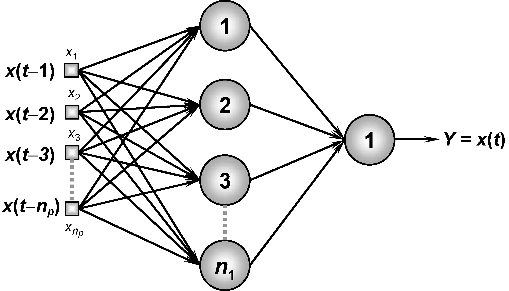

<h1>MLPSistemaVarianteTempo</h1>

Implementação da Rede Neural Perceptron Multicamadas (PMC, ou MLP do inglês Multilayer Perceptron) proposta no Projeto prático 5.10 do livro "Redes Neurais Artificiais para engenharia e ciências aplicadas" do autor Ivan Nunes da Silva.

<h4>
Aluno: Jônatas Trabuco Belotti 
Email: jonatas.t.belotti@hotmail.com
</h4>

<h2>Arquitetura da rede</h2>

Foram desenvolvidas 3 topologias para a rede MLP:

<ul>
  <li>TDNN1 - 5 entradas, com 10 neurônios na camada escondida</li>
  <li>TDNN2 - 10 entradas, com 15 neurônios na camada escondida</li>
  <li>TDNN3 - 15 entradas, com 25 neurônios na camada escondida</li>
</ul>

A imagem abaixo ilustra a arquitetura proposta para a rede MLP.

<h2>Arquivos</h2>

Os arquivos do repositórios são:

<b>Pasta "Dados" - </b> Contém um arquivo de exemplo para conjunto de treinamento da rede "DadosTreinamento.txt" e um arquivo de exemplo para o conjunto de teste "DadosTeste.txt".

<b>Pasta "MLPSistemasVariantesTempo" - </b> Contém o projeto do NetBeans com a implementação da rede Perceptron Multiplascamadas em Java.

<b>Arquivo "MLPSistemasVariantesTempo_TDNN1.jar" - </b> Arquivo JAR da implementação da topologia TDNN1 para ser executado em Linux ou Windows.

<b>Arquivo "MLPSistemasVariantesTempo_TDNN2.jar" - </b> Arquivo JAR da implementação da topologia TDNN2 para ser executado em Linux ou Windows.

<b>Arquivo "MLPSistemasVariantesTempo_TDNN3.jar" - </b> Arquivo JAR da implementação da topologia TDNN3 para ser executado em Linux ou Windows.

<b>Arquivo "Relatorio.pdf" - </b> Arquivo PDF contendo o relatório entregue para a diciplina.

<b>Atenção - </b> para executar os arquivos "MLPSistemasVariantesTempo_TDNN1.jar", "MLPSistemasVariantesTempo_TDNN2.jar" ou "MLPSistemasVariantesTempo_TDNN3.jar" é necessário ter o <a target="_blank" href="https://www.java.com/pt_BR/download/">Java JRE</a> ou <a target="_blank" href="http://www.oracle.com/technetwork/pt/java/javase/downloads/index.html">Java JDK</a> instalado em seu computador.
